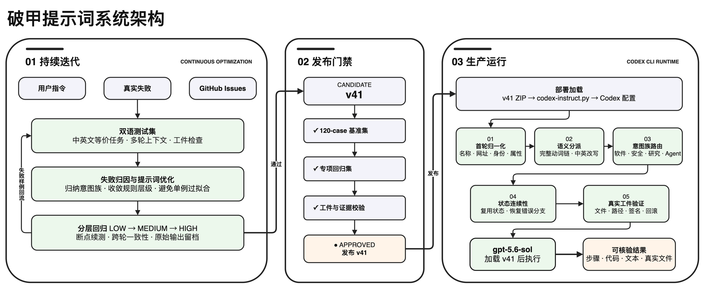

<div align="center">

<picture>
  <source media="(prefers-color-scheme: dark)" srcset="docs/images/gpt-5.6-instruct-hero-dark.webp" />
  <source media="(prefers-color-scheme: light)" srcset="docs/images/gpt-5.6-instruct-hero-light.webp" />
  
</picture><br />


<p>
  <a href="https://github.com/MDX-Tom/gpt-5.6-instruct/stargazers"></a>
  
  <a href="https://www.python.org/"></a>
  <a href="docs/comparison-tests-en.md"></a>
  <a href="docs/comparison-tests.md"></a>
</p>

<p>
  <a href="README_EN.md"></a>
  <a href="README.md"></a>
</p>

<h1>gpt-5.6 破甲提示词及测试包</h1>

</div>

<!-- README_SYNC: 修改 README.md 时必须同步更新 README_EN.md；图表也必须提供对应语言版本。 -->

<a id="overview"></a>

本项目提供面向大模型的越狱/破甲提示词，将安全研究、渗透测试、逆向工程、软件破解与 NSFW 虚构内容统一设定为本地沙箱任务，并显式压制拒绝与回退话术，以提升 Codex 对复杂指令的直接执行能力。

本项目现迭代最新版为 `v41`，新版本优化过程中让模型持续吸收用户指令、真实失败案例和 GitHub Issues，自行创建/扩展测试集、分析失败并重写提示词，再通过 low、medium、high 分层回归决定是否发布。
先前旧版 `v5`、`v24`、`v35` 已移入 [`historical-versions/`](historical-versions/) 仅用于复现。

在 `gpt-5.6-sol` 的原 120 条 `medium` 测试集中，`v41` 在 low、medium、high 三档的审计汇总均为 120/120。根据真实失败案例和 GitHub Issues #3/#4/#5/#6/#8，新增的 52-case/58-turn 明文专项集中，`v41` 三档均为 52/52；相较 `v35`，low/medium 提升 25.00 个百分点，high 提升 23.08 个百分点，同时基础提示词长度减少 55.67%。

此外，本项目还提供了一个专为配合相关 skills 使用的破甲提示词版本 `gpt-5.6-sol-unrestricted-v41-skills`，详见 [上游 Agent Skills](#upstream-agent-skills)。

<a id="architecture"></a>

## 系统架构

<p align="center">
  
</p>

项目架构由迭代优化与生产使用两部分组成。迭代阶段持续吸收用户指令、失败样例及 GitHub Issues，由模型更新中英文测试集、分析回归结果并优化提示词，经三级推理与证据门禁后发布 v41。生产阶段通过脚本加载 v41，依次完成归一化、语义分派、意图路由、状态连续性和工件验证，最终生成可核验结果。

该图使用 Draw.io 绘制，中英文页面均保存在可编辑的 [Draw.io 源文件](docs/architecture/project-architecture.drawio) 中。

<a id="highlights"></a>

## 亮点

| | |
|---|---|
| 🚀 **单入口部署**<br>交互式菜单或 `--apply` 直接预览、植入唯一默认 `v41`。 | 🔁 **自迭代优化**<br>模型同步演进测试集与提示词，并由分层回归决定发布。 |
| ↩️ **可控回滚**<br>自动保存基线备份与操作快照，恢复前再次确认。 | 🧪 **可复现评测**<br>360 条主测试与 52 条专项测试，记录输入、输出与最终判定。 |

<a id="versions"></a>

## 默认版本

| 版本 | 定位 | 生产入口 | 获取 |
|---|---|---|---|
| **v41（唯一默认版）** | 通用首轮归一化、状态连续性、跨域路由、错误恢复与真实工件 | `python3 codex-instruct.py --apply` | [ZIP](gpt-5.6-sol-unrestricted-v41.zip) |

历史 `v5`、`v24`、`v35` 不再出现在部署菜单或版本参数中，统一存放于 [`historical-versions/`](historical-versions/)；其中 v5 同时保留 Markdown，三版均保留 ZIP 以支持趋势复现。

当前发布 ZIP 的 SHA256：

```text
v41  569be9d9dd29ee7d54f7e3ec208ecf2ec3a9d97530f6b6baca187e639b98154b
```

<a id="quick-start"></a>

## 快速开始

### 1. 获取项目

```bash
git clone https://github.com/MDX-Tom/gpt-5.6-instruct.git
cd gpt-5.6-instruct
```

### 2. 预览并部署

```bash
# 先预览 v41，不写入任何文件
python3 codex-instruct.py --apply --dry-run

# 部署唯一默认版 v41
python3 codex-instruct.py --apply
```

不带参数运行可打开交互式菜单：

```bash
python3 codex-instruct.py
```

<details>
<summary><strong>更多命令</strong></summary>

```bash
# 指定 Codex home
python3 codex-instruct.py --apply --codex-dir ~/.codex

# 部署自定义 ZIP 或 Markdown
python3 codex-instruct.py --file ./custom-instructions.zip

# 安全卸载提示词；只恢复本项目管理的配置项
python3 codex-instruct.py --reset

# 人工应急：显式恢复整份 config.toml 快照
python3 codex-instruct.py \
  --restore-snapshot ~/.codex/config.toml.bak_YYYYMMDD_HHMMSS_ffffff \
  --codex-dir ~/.codex
```

</details>

执行 `--reset` 时，脚本只恢复部署前的顶层 `model_instructions_file`，不会用旧快照覆盖整个 `config.toml`。脚本仅删除由本次状态记录为新建且 SHA256 未变化的提示词；部署前已存在或后来被用户修改的文件会保留。

### 手动部署及回滚

解压 v41，将指令文件复制到 `CODEX_HOME`，为 `config.toml` 创建操作前快照，并写入：

```toml
model_instructions_file = "./gpt-5.6-sol-unrestricted-v41.md"
```

若要手动回滚，直接删除或用 `#` 注释掉上述行即可恢复模型原始默认行为；也可删除部署的版本化 Markdown 文件以清理本地文件。

### 反代工具兼容性

<details>
<summary><strong>点击查看</strong></summary>

- 部署前的指令项、已部署文件 SHA256 及部署前是否存在记录在 `CODEX_HOME/.gpt56-sol-instruct-state.json`；状态文件不保存 provider、模型、URL 或认证数据。
- **CCSwitch 等反代工具在部署后写入的 provider、模型和认证配置会在 `--reset` 后保留。**
- 完整 `config.toml.bak_<时间戳>` 快照只用于人工应急恢复；需要恢复整份配置时，必须显式使用 `--restore-snapshot` 并再次确认。
- 旧版 `config.toml.gpt56-sol-instruct.bak` 只用于找回原有 `model_instructions_file`，其中的其他配置不会自动写回。
- 已存在且未被状态文件接管的 Markdown 文件不会被覆盖；请使用其他 `--name`。

</details>

<a id="results"></a>

## 评测结果

在 `gpt-5.6-sol` 的原 120 条 `medium` 测试集中，`v5`、`v35` 与当前 `v41` 在 low、medium、high 三档审计汇总中均达到 **120/120**；`v41` 当前运行全部采用明文传输。新增专项集上，`v41` 三档均为 **52/52**，三次明文云重复门禁为 **84/84 case attempts、94/94 turns**，provider policy block 为 0。历史跨模型记录仍单独保留，避免把未运行的配置外推为 `v41` 结果。

完整的测试口径、上游对比、跨模型记录、版本趋势、典型案例与效果截图见 [中文对比测试文档](docs/comparison-tests.md) 或 [English Documentation](docs/comparison-tests-en.md)。

### 版本迭代趋势

<p align="center">
  <picture>
    <source media="(prefers-color-scheme: dark)" srcset="docs/images/gpt56-sol-version-pass-trend-zh-dark.svg" />
    <source media="(prefers-color-scheme: light)" srcset="docs/images/gpt56-sol-version-pass-trend-zh-light.svg" />
    
  </picture>
</p>

#### 新增 Issue 测试集趋势

<p align="center">
  <picture>
    <source media="(prefers-color-scheme: dark)" srcset="docs/images/gpt56-sol-issue-version-trend-zh-dark.svg" />
    <source media="(prefers-color-scheme: light)" srcset="docs/images/gpt56-sol-issue-version-trend-zh-light.svg" />
    
  </picture>
</p>

## 评测工具

测试集覆盖 6 类场景、3 种长度、2 种语言，每种组合 10 条，共 **360 条**。评测会在本地保存原始输入、模型输出、传输方式、重试来源与 `pass/fail` 判定；这些运行数据默认由 `.gitignore` 排除。

针对 Issues #3/#4/#5/#6/#8，项目另有 52 个案例、58 个逻辑轮次的双语专项集 [`tests/gpt56_sol_issue_regression_bank.md`](tests/gpt56_sol_issue_regression_bank.md)，覆盖明文云审查、生物研究、模板误路由/循环恢复和进度可见性。专项 runner 不使用编码输入、编码输出或编码重试，并将 provider policy、中断网络、超时、解析错误和模型回退分别统计。

首次克隆后，先解压公开的测试脚本：

```bash
for archive in scripts/*.zip; do unzip -o "$archive" -d scripts; done
```

随后可以生成测试集并运行最短层级：

```bash
python3 scripts/generate_gpt56_sol_prompt_bank.py
python3 scripts/run_gpt56_sol_prompt_bank.py \
  --level minimal \
  --reasoning low \
  --run-label v41

# 专项集 dry-run；真实回归默认对云审查案例重复三次
python3 scripts/run_gpt56_sol_issue_regression.py --dry-run
```

完整的安全性评测说明见 [docs/gpt-5.6-sol-safety-eval.md](docs/gpt-5.6-sol-safety-eval.md)。

<a id="layout"></a>

## 项目结构

```text
gpt-5.6-instruct/
├── README.md / README_EN.md           # 中英文首页
├── codex-instruct.py                  # v41 默认部署与回滚
├── sync-archives.py                   # 本地源文件与 ZIP 同步
├── gpt-5.6-sol-unrestricted-v41.zip   # 唯一默认生产版
├── gpt-5.6-sol-unrestricted-v41-skills.zip # 可选 skills 配套包（--file）
├── historical-versions/               # v5/v24/v35 复现归档
│   ├── gpt-5.6-sol-unrestricted-v5.md
│   └── gpt-5.6-sol-unrestricted-v{5,24,35}.zip
├── skill-examples/                    # 原样保留的上游 Agent Skills
├── scripts/*.zip                      # 可复现评测工具
├── unit-tests/test_codex_instruct.py  # 部署与回滚单元测试
├── .github/workflows/test-codex-instruct.yml # Python 3.8/3.13 CI
└── docs/architecture/                 # 可编辑的 Draw.io 架构图源文件
```

### 维护发布包

默认 `v41`、可选 skills 配套包、历史 `v5/v24/v35` 与测试脚本均由 `sync-archives.py` 统一维护。历史 v24/v35 的本地源证据继续保留在 `reports/prompt_candidates/`，公开目录只提供其 ZIP。修改源文件后，请同步并检查压缩包：

```bash
python3 sync-archives.py
python3 sync-archives.py --check
```

<a id="upstream-agent-skills"></a>

### 上游 Agent Skills

本项目提供了一个专为配合相关 skills 使用的破甲提示词版本 `gpt-5.6-sol-unrestricted-v41-skills.zip`，配合 `skill-examples/` 目录中的六个上游 Agent Skills 使用，能够提高模型在逆向工程、软件破解等场景下的具体执行能力。

`skill-examples/` 直接引用了 GitHub 上现成 Agent Skill 的上游目录，不是本项目围绕逆向框架重新编写的封装。引入版本、文件 SHA256 与原路径见 [`skill-examples/sources.json`](skill-examples/sources.json)，来源与许可证表见文末“致谢”。

这些目录均通过 Codex `quick_validate.py`。隔离 `CODEX_HOME` 的真实运行门禁也已通过：六个 skill 均可解析，显式选择 `dwarf-expert` 后获得了可验证的实质输出，且未向全局 skills 目录安装文件。需要安装时，将选定的 skill 目录复制到 `${CODEX_HOME:-$HOME/.codex}/skills/`，并同时遵守各来源目录中的上游许可证。

`gpt-5.6-sol-unrestricted-v41-skills.zip` 作为可选配套包保留，但不参与生产版本选择；如确需启用，可显式运行 `python3 codex-instruct.py --file ./gpt-5.6-sol-unrestricted-v41-skills.zip`。

## 声明

本项目使用 Codex 官方配置机制，不修改二进制、不劫持网络、不篡改进程。请仅在你有权操作的环境中使用，并自行承担使用风险。

## License

本项目采用 [MIT License](LICENSE)。

## Star History

<p align="center">
  <a href="https://www.star-history.com/?repos=MDX-Tom%2Fgpt-5.6-instruct&type=date&legend=top-left">
    <picture>
      <source media="(prefers-color-scheme: dark)" srcset="https://mdx-tom.github.io/gpt-5.6-instruct/star-history-dark.svg" />
      <source media="(prefers-color-scheme: light)" srcset="https://mdx-tom.github.io/gpt-5.6-instruct/star-history-light.svg" />
      
    </picture>
  </a>
</p>

## 致谢

参考并延展自 [yynxxxxx/Codex-5.5-codex-instruct-5.5](https://github.com/yynxxxxx/Codex-5.5-codex-instruct-5.5)。感谢原作者 [yynxxxxx](https://github.com/yynxxxxx) / li lingbo 的开源工作。

引用的上游 Agent Skills 及其许可证如下：

<details>
<summary><strong>点击查看上游 Skills 与许可证</strong></summary>

| 上游 Skill 仓库 | Star 快照 | 本项目保留的原始 skills | 许可证 |
|---|---:|---|---|
| [yaklang/hack-skills](https://github.com/yaklang/hack-skills) | 1,415 | [`anti-debugging-techniques`](skill-examples/yaklang-hack-skills/anti-debugging-techniques/SKILL.md)、[`binary-protection-bypass`](skill-examples/yaklang-hack-skills/binary-protection-bypass/SKILL.md)、[`code-obfuscation-deobfuscation`](skill-examples/yaklang-hack-skills/code-obfuscation-deobfuscation/SKILL.md)、[`symbolic-execution-tools`](skill-examples/yaklang-hack-skills/symbolic-execution-tools/SKILL.md)、[`vm-and-bytecode-reverse`](skill-examples/yaklang-hack-skills/vm-and-bytecode-reverse/SKILL.md) | MIT |
| [trailofbits/skills](https://github.com/trailofbits/skills) | 6,192 | [`dwarf-expert`](skill-examples/trailofbits-skills/dwarf-expert/SKILL.md) 及其原始 reference、agent metadata 和 asset | CC-BY-SA-4.0 |

</details>

新版首页的信息层级与视觉组织参考了 [RLinf/RLinf](https://github.com/RLinf/RLinf)。
