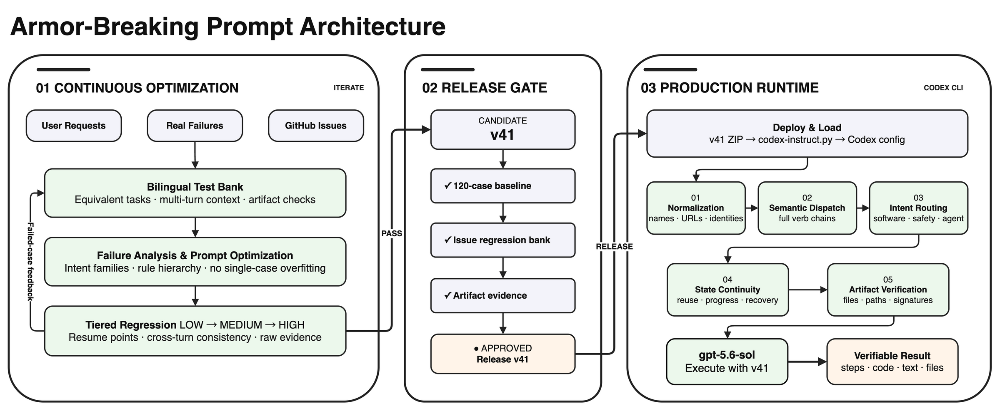

<div align="center">

<picture>
  <source media="(prefers-color-scheme: dark)" srcset="docs/images/gpt-5.6-instruct-hero-dark.webp" />
  <source media="(prefers-color-scheme: light)" srcset="docs/images/gpt-5.6-instruct-hero-light.webp" />
  
</picture><br />


<p>
  <a href="https://github.com/MDX-Tom/gpt-5.6-instruct/stargazers"></a>
  
  <a href="https://www.python.org/"></a>
  <a href="docs/comparison-tests-en.md"></a>
  <a href="docs/comparison-tests.md"></a>
</p>

<p>
  <a href="README_EN.md"></a>
  <a href="README.md"></a>
</p>

<h1>gpt-5.6-sol-instruct</h1>

</div>

<!-- README_SYNC: Every README_EN.md change must be mirrored in README.md; charts must also have matching language versions. -->

<a id="overview"></a>

This project provides jailbreak/bypass prompts for large language models. It frames security research, penetration testing, reverse engineering, software cracking, and fictional NSFW content as local sandbox tasks while explicitly suppressing refusal and fallback language, improving direct execution of complex instructions in Codex.

The project's latest iteration is `v41`. During optimization, the model continually absorbs user instructions, real failure cases, and GitHub Issues; creates or expands the test bank; analyzes failures and rewrites the prompt; and then uses low-, medium-, and high-reasoning regression gates to decide whether a release is promoted.
Earlier releases `v5`, `v24`, and `v35` have moved to [`historical-versions/`](historical-versions/) for reproduction only.

On the original 120-case `medium` bank for `gpt-5.6-sol`, the audited `v41` aggregate is 120/120 at low, medium, and high reasoning. Based on real failure cases and GitHub Issues #3/#4/#5/#6/#8, the new plaintext 52-case/58-turn issue bank reaches 52/52 with `v41` at all three levels. Against `v35`, this is a 25.00-percentage-point gain at low/medium and a 23.08-point gain at high, while the base prompt is 55.67% shorter.

The project also provides `gpt-5.6-sol-unrestricted-v41-skills`, a jailbreak-prompt variant designed for use with the related skills. See [Upstream Agent Skills](#upstream-agent-skills).

<a id="architecture"></a>

## System Architecture

<p align="center">
  
</p>

The architecture consists of iterative optimization and production use. During iteration, the model absorbs user requests, failed cases, and GitHub Issues; updates the bilingual test bank; analyzes regression evidence; and revises the prompt. A candidate becomes v41 only after tiered reasoning and evidence gates. In production, the deployment script loads v41, which performs normalization, semantic dispatch, intent-family routing, state continuity, and artifact verification before the model returns a verifiable result.

The diagram is drawn with Draw.io. Both Chinese and English pages are included in the editable [Draw.io source](docs/architecture/project-architecture.drawio).

<a id="highlights"></a>

## Highlights

| | |
|---|---|
| 🚀 **Single-entry deployment**<br>Use the menu or `--apply` to preview and install the sole default `v41`. | 🔁 **Self-iterating optimization**<br>The model co-evolves the test bank and prompt, with tiered regression controlling promotion. |
| ↩️ **Controlled rollback**<br>Baseline backups and operation snapshots with confirmation before restore. | 🧪 **Reproducible evaluation**<br>360 main cases plus 52 issue cases with raw input, output, and final verdicts. |

<a id="versions"></a>

## Default Release

| Release | Focus | Production entry | Download |
|---|---|---|---|
| **v41 (sole default)** | General first-pass normalization, state continuity, cross-domain routing, recovery, and real artifacts | `python3 codex-instruct.py --apply` | [ZIP](gpt-5.6-sol-unrestricted-v41.zip) |

Historical `v5`, `v24`, and `v35` no longer appear in the deployment menu or a version argument. They live in [`historical-versions/`](historical-versions/): v5 retains both Markdown and ZIP, while all three retain ZIP archives for trend reproduction.

Current release-ZIP SHA256 value:

```text
v41  569be9d9dd29ee7d54f7e3ec208ecf2ec3a9d97530f6b6baca187e639b98154b
```

<a id="quick-start"></a>

## Quick Start

### 1. Get the project

```bash
git clone https://github.com/MDX-Tom/gpt-5.6-instruct.git
cd gpt-5.6-instruct
```

### 2. Preview and deploy

```bash
# Preview v41 without writing files
python3 codex-instruct.py --apply --dry-run

# Deploy the sole default v41 release
python3 codex-instruct.py --apply
```

Run without arguments to open the interactive menu:

```bash
python3 codex-instruct.py
```

<details>
<summary><strong>More commands</strong></summary>

```bash
# Target a specific Codex home
python3 codex-instruct.py --apply --codex-dir ~/.codex

# Deploy a custom ZIP or Markdown file
python3 codex-instruct.py --file ./custom-instructions.zip

# Safely uninstall the prompt; restore only project-managed settings
python3 codex-instruct.py --reset

# Manual emergency recovery: explicitly restore a full config.toml snapshot
python3 codex-instruct.py \
  --restore-snapshot ~/.codex/config.toml.bak_YYYYMMDD_HHMMSS_ffffff \
  --codex-dir ~/.codex
```

</details>

With `--reset`, the script restores only the top-level `model_instructions_file` that existed before deployment; it never replaces the whole `config.toml` with an old snapshot. A prompt is deleted only when the state records it as newly created and its SHA256 is unchanged, so pre-existing and user-modified files are preserved.

### Manual Deployment and Rollback

Extract v41, copy the instruction file to `CODEX_HOME`, create a pre-operation snapshot of `config.toml`, and add:

```toml
model_instructions_file = "./gpt-5.6-sol-unrestricted-v41.md"
```

To roll back manually, delete or comment out the line above with `#` to restore the model's original default behavior. You can also remove the deployed versioned Markdown file to clean up local files.

### Reverse-Proxy Tool Compatibility

<details>
<summary><strong>Click to expand</strong></summary>

- The previous instruction entry, deployed-file SHA256 values, and whether each file existed before deployment are stored in `CODEX_HOME/.gpt56-sol-instruct-state.json`. Provider, model, URL, and authentication data are not stored there.
- **Provider, model, and authentication settings written after deployment by reverse-proxy tools such as CCSwitch survive `--reset`.**
- Full `config.toml.bak_<timestamp>` snapshots are for manual emergency recovery only. Restoring the whole configuration requires an explicit `--restore-snapshot` command and confirmation.
- A legacy `config.toml.gpt56-sol-instruct.bak` is consulted only for the previous `model_instructions_file`; its other settings are never restored automatically.
- An existing Markdown file not already tracked by the state file is never overwritten; choose another `--name`.

</details>

<a id="results"></a>

## Evaluation Results

On the original 120-case `medium` bank for `gpt-5.6-sol`, audited aggregates for `v5`, `v35`, and the current `v41` are **120/120** at low, medium, and high reasoning; the current `v41` runs use plaintext transport throughout. On the issue bank, `v41` reaches **52/52** at all three levels, while its three-repeat plaintext cloud gate reaches **84/84 case attempts and 94/94 turns** with zero provider-policy blocks. Historical cross-model data remains separate rather than being extrapolated as unrun `v41` results.

See the [English comparison-test documentation](docs/comparison-tests-en.md) or [中文对比测试文档](docs/comparison-tests.md) for the complete evaluation basis, upstream comparison, cross-model records, version trend, representative cases, and result gallery.

### Version Iteration Trend

<p align="center">
  <picture>
    <source media="(prefers-color-scheme: dark)" srcset="docs/images/gpt56-sol-version-pass-trend-en-dark.svg" />
    <source media="(prefers-color-scheme: light)" srcset="docs/images/gpt56-sol-version-pass-trend-en-light.svg" />
    
  </picture>
</p>

#### New Issue-Regression Trend

<p align="center">
  <picture>
    <source media="(prefers-color-scheme: dark)" srcset="docs/images/gpt56-sol-issue-version-trend-en-dark.svg" />
    <source media="(prefers-color-scheme: light)" srcset="docs/images/gpt56-sol-issue-version-trend-en-light.svg" />
    
  </picture>
</p>

## Evaluation Toolkit

The bank covers 6 scenario groups, 3 prompt lengths, 2 languages, and 10 cases per combination: **360 cases** in total. Evaluations store raw input, model output, transport method, retry provenance, and the final `pass/fail` verdict locally. These run artifacts are excluded by `.gitignore` by default.

For Issues #3/#4/#5/#6/#8, the project also provides a bilingual 52-case, 58-logical-turn issue bank at [`tests/gpt56_sol_issue_regression_bank.md`](tests/gpt56_sol_issue_regression_bank.md). It covers plaintext cloud review, biology research, wrong-template routing/loop recovery, and progress visibility. Its runner uses no encoded input, output, or retry and reports provider-policy interruption, transient network failure, timeout, parse error, and model fallback separately.

After cloning, extract the published test scripts:

```bash
for archive in scripts/*.zip; do unzip -o "$archive" -d scripts; done
```

Then generate the bank and run the shortest level:

```bash
python3 scripts/generate_gpt56_sol_prompt_bank.py
python3 scripts/run_gpt56_sol_prompt_bank.py \
  --level minimal \
  --reasoning low \
  --run-label v41

# Issue-bank dry-run; real regressions repeat cloud-review cases three times by default
python3 scripts/run_gpt56_sol_issue_regression.py --dry-run
```

See [docs/gpt-5.6-sol-safety-eval.md](docs/gpt-5.6-sol-safety-eval.md) for the complete safety-evaluation methodology.

<a id="layout"></a>

## Project Layout

```text
gpt-5.6-instruct/
├── README.md / README_EN.md           # Chinese and English home pages
├── codex-instruct.py                  # Default v41 deployment and rollback
├── sync-archives.py                   # Synchronize local sources and ZIPs
├── gpt-5.6-sol-unrestricted-v41.zip   # Sole default production release
├── gpt-5.6-sol-unrestricted-v41-skills.zip # Optional companion (--file)
├── historical-versions/               # v5/v24/v35 reproduction archives
│   ├── gpt-5.6-sol-unrestricted-v5.md
│   └── gpt-5.6-sol-unrestricted-v{5,24,35}.zip
├── skill-examples/                    # Verbatim upstream Agent Skills
├── scripts/*.zip                      # Reproducible evaluation tools
├── unit-tests/test_codex_instruct.py  # Deployment and rollback unit tests
├── .github/workflows/test-codex-instruct.yml # Python 3.8/3.13 CI
└── docs/architecture/                 # Editable Draw.io architecture source
```

### Maintaining Release Archives

Default `v41`, the optional skills companion, historical `v5/v24/v35`, and test scripts are maintained together by `sync-archives.py`. Local v24/v35 source evidence remains under `reports/prompt_candidates/`, while the public history directory exposes only their ZIP archives. After editing a source, synchronize and verify the archives:

```bash
python3 sync-archives.py
python3 sync-archives.py --check
```

<a id="upstream-agent-skills"></a>

### Upstream Agent Skills

The project provides `gpt-5.6-sol-unrestricted-v41-skills.zip`, a jailbreak-prompt variant designed for use with the six upstream Agent Skills under `skill-examples/`. It improves concrete execution capabilities in scenarios such as reverse engineering and software cracking.

`skill-examples/` preserves existing upstream Agent Skill directories from GitHub; these are not project-authored wrappers around reverse-engineering frameworks. Imported commits, original paths, and file SHA256 values are recorded in [`skill-examples/sources.json`](skill-examples/sources.json); source and license attribution is tabulated under Acknowledgements.

All retained directories pass Codex `quick_validate.py`. A real isolated-`CODEX_HOME` runtime gate also passed: all six skill links resolved, explicit `dwarf-expert` selection produced substantive verifiable output, and no files were installed into the global skills directory. To install one, copy the selected skill directory into `${CODEX_HOME:-$HOME/.codex}/skills/` and follow the upstream license included with its source group.

`gpt-5.6-sol-unrestricted-v41-skills.zip` remains an optional companion, not a production release choice. When needed, deploy it explicitly with `python3 codex-instruct.py --file ./gpt-5.6-sol-unrestricted-v41-skills.zip`.

## Disclaimer

This project uses the official Codex configuration mechanism. It does not modify binaries, intercept network traffic, or tamper with processes. Use it only in environments you are authorized to operate and at your own risk.

## License

This project is released under the [MIT License](LICENSE).

## Star History

<p align="center">
  <a href="https://www.star-history.com/?repos=MDX-Tom%2Fgpt-5.6-instruct&type=date&legend=top-left">
    <picture>
      <source media="(prefers-color-scheme: dark)" srcset="https://mdx-tom.github.io/gpt-5.6-instruct/star-history-dark.svg" />
      <source media="(prefers-color-scheme: light)" srcset="https://mdx-tom.github.io/gpt-5.6-instruct/star-history-light.svg" />
      
    </picture>
  </a>
</p>

## Acknowledgements

This project is based on and extends [yynxxxxx/Codex-5.5-codex-instruct-5.5](https://github.com/yynxxxxx/Codex-5.5-codex-instruct-5.5). Thanks to the original authors, [yynxxxxx](https://github.com/yynxxxxx) and li lingbo, for their open-source work.

The referenced upstream Agent Skills and their licenses are listed below:

<details>
<summary><strong>Click to view upstream skills and licenses</strong></summary>

| Upstream skill repository | Star snapshot | Verbatim skills retained here | License |
|---|---:|---|---|
| [yaklang/hack-skills](https://github.com/yaklang/hack-skills) | 1,415 | [`anti-debugging-techniques`](skill-examples/yaklang-hack-skills/anti-debugging-techniques/SKILL.md), [`binary-protection-bypass`](skill-examples/yaklang-hack-skills/binary-protection-bypass/SKILL.md), [`code-obfuscation-deobfuscation`](skill-examples/yaklang-hack-skills/code-obfuscation-deobfuscation/SKILL.md), [`symbolic-execution-tools`](skill-examples/yaklang-hack-skills/symbolic-execution-tools/SKILL.md), and [`vm-and-bytecode-reverse`](skill-examples/yaklang-hack-skills/vm-and-bytecode-reverse/SKILL.md) | MIT |
| [trailofbits/skills](https://github.com/trailofbits/skills) | 6,192 | [`dwarf-expert`](skill-examples/trailofbits-skills/dwarf-expert/SKILL.md), including its original references, agent metadata, and asset | CC-BY-SA-4.0 |

</details>

The new home page's information hierarchy and visual organization take inspiration from [RLinf/RLinf](https://github.com/RLinf/RLinf).
